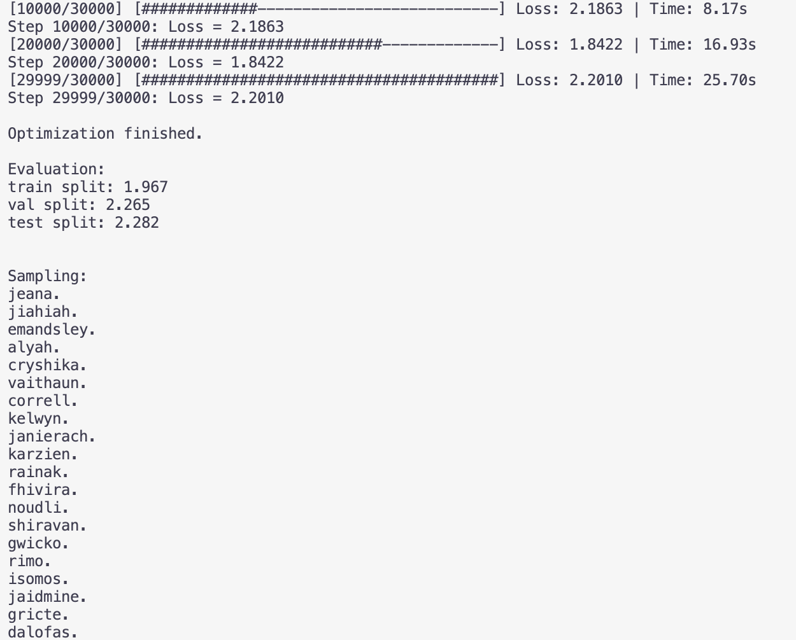
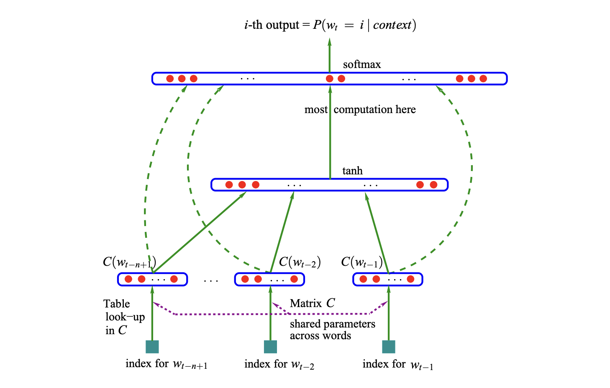
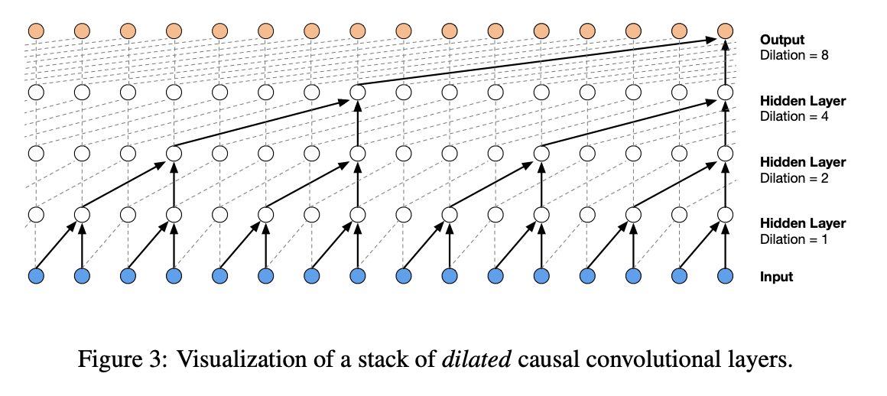

# Makemore:
An Autoregressive Character-Level Language Model that predicts new words



## Introduction

This project, based on [@AndrejKarpathy's](https://github.com/karpathy) lecture series, explores the development of an autoregressive character-level language model for generating text similar to a given dataset. The dataset used is a list of 32,000 names (`names.txt`), and the goal is to train a model to predict the next character in a sequence, ultimately generating new names that resemble the originals. The journey begins with a simple bigram model and progresses through various neural network architectures and also a manual implementatation of PyTorch's backward() backpropagation function. The models implemented include:

- **Bigram Model**: A basic model where one character predicts the next based on a lookup table of counts.
- **MLP (Multilayer Perceptron)**: Following the approach of Bengio et al. (2003), this model leverages neural networks to improve prediction accuracy.
- **CNN (Convolutional Neural Network)**: Inspired by the WaveNet paper by DeepMind (2016), this model captures more complex patterns in the data.

## Usage

### 1. Prepare the Dataset

Ensure that you have a text file named `names.txt` in the same directory as your script. This file should contain the dataset of words, with each word on a new line. The model will use these words to learn character sequences.

### 2. Run the Script

To train the model and generate samples, simply run the `main.py` script:

```bash
python makemore.py
```

### 3. Modify Hyperparameters

If you want to adjust the model or training settings, you can do so by modifying the following hyperparameters in the `main()` function:

- `block_size`: Length of the context (number of characters) used to predict the next character.
- `n_embd`: Number of dimensions for character embeddings.
- `n_hidden`: Number of hidden neurons in the model.
- `steps`: Number of training steps.
- `batch_size`: Size of each training batch.

### 4. Training Progress

The script includes a progress bar during training, displaying the current step, loss, and elapsed time. You can monitor the training process directly in your console.

### 5. Model Evaluation

After training, the script evaluates the model on training, validation, and test splits, providing a loss for each split:

```
Evaluation example:
train split: 1.234
val split: 1.345
test split: 1.456
```

### 6. Generate Samples

Once the model is trained, it will generate character sequences based on the learned patterns. The generated sequences will be displayed in the console:

```
Sampling:
carlyn.
eloosa.
jamira.
```

## Learnings

### Part 1: Building a Bigram Model

- **Bigram:** In this model, the next character is predicted based on the current character, considering only two characters at a time.
    - The model predicts by counting the occurrences of character pairs and choosing the next character based on multinomial probabilities.
    - Achieved a negative log-likelihood (NLL) of roughly 2.46, which serves as a benchmark for evaluating the model's performance.

- **Neural Network Version:**
    - Inputs are transformed into one-hot encoded vectors and fed into a neural network with random weights.
    - Outputs are probabilities normalized over possible next characters.
    - The loss is calculated using negative log likelihood, and gradient descent is used to optimize the weights.
    - Achieved similar NLL as the bigram model but now allows for extensions to handle multiple characters.

### Part 2: Building an MLP (Multilayer Perceptron)

- represent words as vectors, where words that appear in similar contexts are closer to each other in vector space
- feed preceding words to NN, get probability output for next word
- **Context Tensor:** Sequences of three characters are used to predict the next character. This creates a context for the model.
- **Embeddings:** A lookup matrix is used to convert characters into embeddings, which are then processed by the neural network.
- **Model Architecture:**
    - The context tensor is reshaped and processed through two linear layers with tanh activations.
    - Cross-entropy loss is used for training.
- **Hyperparameter Tuning:** Techniques such as learning rate decay, mini-batches, and context length adjustments are explored to optimize the model.
- **Final Hyperparameters:**
    - Context Length = 4
    - Embedding Dimensions = 10
    - Hidden Layer Neurons = 200
    - Steps = 200,000
    - Batch Size = 64

### Part 3: Batch Normalization

- **Initialization:** Weights are initialized to ensure initial logits are uniform, preventing dead neurons and improving training stability.
- **Weight Initialization:** Weights are initialized using specific gains depending on the activation function (e.g., sqrt(2) for ReLU).
- **Batch Normalization:** This technique normalizes pre-activation hidden states to stabilize training. It adds regularization and makes biases unnecessary.
- **Non-Linear Activations:** Tanh or ReLU functions are used after each linear layer to ensure the model captures non-linear patterns.

### Part 4: Manual Backpropagation

- **Forward and Backward Passes:** Implemented without using any PyTorch functions, focusing on the correct shapes and gradients.
- **Gradient Calculations:** Detailed calculations are performed for each layer, ensuring that the gradients match the dimensions of the original tensors.

### Part 5: Building a WaveNet

- **Sequential Model:** The model is built using a sequence of layers, including embedding, flattening, and linear layers with batch normalization.
- **Progressive Combination:** Instead of combining context characters into one big tensor initially, the model combines them progressively, capturing more intricate patterns.

- **Dilated Layers:** Inspired by WaveNet, dilated convolutions are used to capture long-range dependencies in the data.

## Definitions to Remember

- **Keeping Dimensions:** Ensures that the resulting tensor from operations like summing maintains the original shape, facilitating further operations.
- **Broadcasting:** Automatically expands smaller tensors to match the shape of larger tensors for element-wise operations.
- **One-Hot Encoding:** Represents integers as vectors where only one element is "hot" (set to 1), making it compatible with neural networks.
- **Log Likelihood:** The logarithm of the likelihood, used to avoid tiny probabilities. The log likelihood is summed rather than multiplied.
- **Regularization:** Techniques used to prevent overfitting by penalizing model complexity.
- **Strides:** Information that helps map tensor positions to memory locations, crucial for efficient computation.
    
- **Cross-Entropy Loss:** A loss function that compares predicted probabilities with true class labels, heavily penalizing incorrect predictions.
- **Batch Normalization:** A method to normalize activations in a neural network, improving training stability.
- **Dead Neurons:** Neurons that stop learning because their gradients become zero, often due to poor initialization.
- **Convolution:** An operation that slides over inputs to detect features, enabling the reuse of neurons and reducing computation.

## Conclusion

Makemore demonstrates the evolution of a simple bigram model into advanced neural network architectures, capable of generating realistic names by predicting character sequences. Each part of the project introduces key concepts and techniques in machine learning, from basic probability models to sophisticated deep learning approaches, providing a comprehensive understanding of autoregressive character-level modeling.
