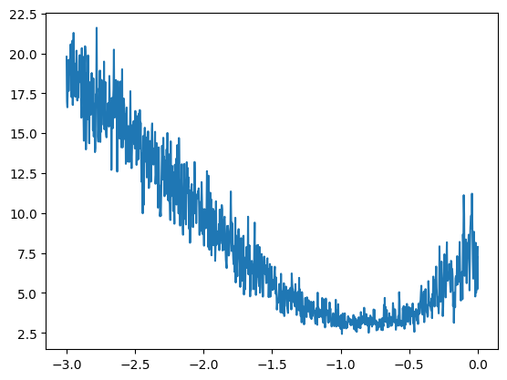

# makemore
An autoregressive character-level language model for making generating the more things

## Introduction


## Learnings

### Part 1: Building a bi-gram

- bigram: look at the given character, predict the next one (always only look at two characters)
	- predict by counting the occurances of two characters after each other and choose the next one based on multinomial probabilities
	- achieved nll of roughly 2.46 -> can be used to evaluate the model
- making it a neural net:
	the outputs of the neural net for input 0 (=> '.')
	we transfored the '.' to an integer (0)
	one-hot encoded it as a 27d vector
	fed to neural net by multiplying with random weights W
	exponentiated to get outputs between 0 and 1
	normalized over rows (in total outputs for each input have probability of 1) to get probabilities
	neural net now predicts probability for each of the 27 next possible characters after '.'
	then we can calculate the loss (neg log likelihood) on predicting the next real character
	```
	probs[0]
	tensor([0.0069, 0.0547, 0.0351, 0.0310, 0.0081, 0.0422, 0.0129, 0.0688, 0.0444,
	0.0223, 0.0168, 0.0233, 0.0776, 0.0435, 0.0523, 0.1066, 0.0867, 0.0229,
	0.0771, 0.0102, 0.0176, 0.0472, 0.0159, 0.0392, 0.0113, 0.0115, 0.0139])
	```
		--------
	bigram example 1: .e (indexes 0,5)
	input to the neural net: 0
	output probabilities from the neural net: tensor([0.0607, 0.0100, 0.0123, 0.0042, 0.0168, 0.0123, 0.0027, 0.0232, 0.0137,
			0.0313, 0.0079, 0.0278, 0.0091, 0.0082, 0.0500, 0.2378, 0.0603, 0.0025,
			0.0249, 0.0055, 0.0339, 0.0109, 0.0029, 0.0198, 0.0118, 0.1537, 0.1459])
	label (actual next character): 5
	probability assigned by the net to the the correct character: 0.012286253273487091
	log likelihood: -4.3992743492126465
	negative log likelihood: 4.3992743492126465
	--------
	```
	# gradient descent
for k in range(100):

	#forward pass
	xenc = F.one_hot(xs, num_classes=27).float()	#0, 5, 13, 13, 1
	logits = (xenc @ W)	# predict log-counts shape[5, 27]: 27 predictions for each of the 5 inputs
	counts = logits.exp()
	probs = counts / counts.sum(1, keepdims=True)	#probabilities for next character
	loss = -probs[torch.arange(num), ys].log().mean()
	print(loss.item())

	#backward pass
	W.grad = None	#more efficient than setting to 0
	loss.backward()

	#update
	W.data += -100 * W.grad
	```
	- achieved nll of roughly 2.46, which is equal to with counting (because bigrams are so simple)
	- but now we can actually extend to do the forward pass on multiple characters

### Part 2: Building an MLP

#### From Paper (Bengio, Y., Ducharme, R., Vincent, P., & Jauvin, C. (2003). A neural probabilistic language model. Journal of Machine Learning Research, 3, 1137-1155.)

- represent words as vectors, where words that appear in similar contexts are closer to each other in vector space
- feed preceding words to NN, get probability output for next word

#### Lecture
- we create a context tensor, that contains all sequences of 3 characters in words
	.em
	emm
	mma
	...
- we create embeddings by creating a look up matrix (random values, 2 per character = tensor(27, 2))
- multiply that by the context tensor, to get a embeddings matrix for each character in the context tensor
- reshape that embedded context tensor, so that each batch is a 6d vector (batch size 3, 2 embedding values)
- matrix mutliplcation with each weight and adding bias, then through tanh activation
- the same with second layer, this time with 27 outputs
- get cross entropy loss
- then reset grads, backpropagate and adjust data towards the negative gradient
- use minibatches (choosing random batch before each forward pass) to increase efficiency
	- gradient will be not exact, but an approximation: still better to make many runs on an approximation than a few on a precise one
- to determine good learning rate:
	- check for which it barely optimizies and for which it does it almost too fast
	- plot learning rate in that window against loss
	- check for where loss is stable (~0.1)
	
	- later decay learning rate by factor of 10 and do a few more steps
- to prevent overfitting
	- split into training, validation and test split (80, 10, 10)
	- use validation split to modify hyperparameters
	- use test split to test on unseen data
- we increased neurons in hidden layer, but didn't lead to much lower loss
	- maybe the embedding is the bottleneck -> increase to 10 dimensions
- when loss of total training set and dev set go apart, it shows potential overfitting
- process:
	- test different sets of hyperparameters until validation set performance gets very good
	- then run on test set

- some further optimizations:
	- double the batch size to 64 (improved devset loss to 2.15)
	- increased context length to 4 (devset loss stayed at 2.15)
	- based on MLP10 in the paper, I increased context length to 5, hidden units to 100, embedding dimenions to 30 (worsened devset loss to 2.20, probably because they use words and not character level models)
	- final hyperparameters:
	CONTEXT_LEN = 4
	EMB_DIM = 10	#embedding dimensions
	HL_NEURONS = 200	#hidden layer neurons
	STEPS = 200000		# n steps
	BATCH_SIZE = 64	#batch size

## Part 3: Batch Normalization
- we want initial logits to be uniform / close to zero, so that initial loss is low
	- set biases to 0 initially, and weights to very small numbers
	- check that tanh neurons are not dead (make weights of input layer closer to zero)
	```python
	C  = torch.randn((vocab_size, n_embd),            generator=g)
	W1 = torch.randn((n_embd * block_size, n_hidden), generator=g) * 0.2
	b1 = torch.randn(n_hidden,                        generator=g) * 0.01
	W2 = torch.randn((n_hidden, vocab_size),          generator=g) * 0.01
	b2 = torch.randn(vocab_size,                      generator=g) * 0
	```
	-> improved losses
	- the deeper the network is, the more important initialization is
- you want to intialize the weights, so that the activations are gaussian more or less (standard deviation of 1)
	- depends on nonlinerarity activation function (ReLU = sqrt(2), tanh = 5/3 ..)
		- because they squash outputs, you need a factor to counter the squeezing
- modern innovations like adam-optimizer, batch normalization.. made good initialization less important
- intialize weights, so that standard deviation of gaussian is roughly gain / sqrt(fan_in)
	- gain depends on function, (ReLU = sqrt(2), tanh = 5/3 ..)
	- fan_in: number of inputs to the layer (context_len * dimensions)
	```python
	W1 = torch.randn((n_embd * block_size, n_hidden), generator=g) * (5/3)/(n_embd*block_size)**0.5
	```
- batch-normalization (2015 paper from google research team)
	- normalize preactivation hidden states to be gaussian (can also be backpropagated through), but only at initialization
		- use bnbias and bngain / gamma and beta to change the normalization (shift it)
	- usually add to every linear layer or convolutional layer a batch normalization layer to stabilize training
	- cost of bn: it's normalized with first batch, but next batches are different, but this leads to regularization / data augmentation which is good
	- to forward single example, for sampling:
		- calculate bnmean and bnstd over entire training set and use that
		- or: you can also calculate bnmeans and std during training and use that (to not have extra step after training)
	- makes biases unnecessary, because we calculate mean and substract it, which means we substract biases
- why do you need tanh non-linear activation functions after each linear layer?
	- otherwise multiple linear layers would just collapse to one big linear layer

## Part 4: Manual Backpropagation
- objective: implement forward and backward pass without using any PyTorch functions (only tensors)
- broadcasting in the forward pass turns into summing in the backward pass and vice versa
- always make sure that shapes of derivates are the same as shapes of their normal version

```
## dlogprobs
# loss 	= - (a + b + c) / 3
#		= -1/3a + -1/3b + - 1/3c
#dloss/da	= -1/3
#general: = -1/n for each of the values
#all other values (that are not plucked out), have gradient 0, becasus they don't impact loss
# so: start with tensor of same shape as logprobs, set everything to zero, set gradient of plucled out values to -1/n
torch.zeros_like(logprobs).shape

##dprobs
# dLoss / dprobs = dLoss / dlogprobs * dlogprobs / dprobs
# 	= dlogprobs * 1.0/probs (derivate of log(x) is 1/x)

##dcounts_sum_inv
# it's a broadcasted tensor, so that needs to be taken into account
# need to sum the broadcasted tensor, because it's used multiple times
##dcounts
# b = a1 + a2 + a3 -> gets its gradient from b

##dlogits
# dlogits += F.one_hot(logits.max(1).indices, num_classes=logits.shape[1]) * dlogit_maxes
# create a vector that has a 1 at each index of the max, rest 0's. then multiply that with global gradient

##dh
# need to transpose W2 and then matrix multiply with dlogits
# a derivative of a matrix multiplication is a matrix multiplication
# can use shapes as a guide to which ones to multiply, dh.shape needs to be h.shape

##db2
# needs to be of shape [27], so need to sum up dlogits over dimension 0, to get rid of 0th dimension and keep 1st (27)
```


## Part 5: Building a WaveNet
- creating embedding, flatten and sequential class
	- embedding: initialize random weights and index with given character indices into it
	- flatten: concatenate vectors
	- sequential: intialized with list of layers and given an input of X values it returns logits and parameters
	- so the model can now be initalized like this:
		```
		model = Sequential([
		Embedding(vocab_size, n_embd),
		Flatten(),
		Linear(n_embd * block_size, n_hidden, bias=False), BatchNorm1D(n_hidden), Tanh(),
		Linear(n_hidden, vocab_size),])
		```
	- and logits and loss are returned by
		```
		# forward pass
		logits = model(Xb)
		loss = F.cross_entropy(logits, Yb) # get loss
		```
- instead of squashing the context characters into one big tensor in the beginning, we will progressively combine them
- we want to group inputs into batches of two, before matrix multiplying

- flatten layer now flattens by always grouping two adjacent inputs (so halving the inputs from layer to layer)
	```
	class FlattenConsecutive:

		def __init__(self, n):
			self.n = n

		def __call__(self, x):
			B, T, C = x.shape
			x = x.view(B, T//self.n, C*self.n)
			if x.shape[1] == 1:
				x = x.squeeze(1)
			self.out = x
			return self.out

		def parameters(self):
			return []
	```


## Definitions to remember
- Keeping Dimensions: Ensures that the resulting tensor from the sum operation has the same shape as the original tensor, making element-wise operations straightforward.
- Broadcasting: A mechanism that allows element-wise operations on tensors of different shapes by automatically expanding the smaller tensor to match the shape of the larger tensor.
- one-hot encoding: take a vector with the length of the amount of integers you want to represent, and put a 0 at all numbers that's not the integer, and a 1 where it is; example: [0, 0, 1, 0, 0] = 2; needed to feed ints into neural nets (you can't just plug in integers)
- log likelihood:
	likelihood of a model = the product of all probabilities of all bigrams
	will be a very tiny number, so you use log-likelihood (will be between -inf and 0)
	log(a * b * c ..) = log(a) + log(b) + log(c) + ..
- regularization:
- strides:
	- this is information stored in a tensor, that helps to translate a tensor to the way it's stored in memory in the computer
	- in memory, just row by row is stored in memory (so for integers, each number is stored by 4 bytes apart)
	- strides tell us how to get from the tensor position to the memory location (by multiplying row and column)
	- e.g.: 
- cross entropy loss: measures the difference between the predicted probabilities and the true class labels. It penalizes incorrect predictions more heavily.
	- softmax activation over output neurons
	- then calculating average negative log likelihood of predictions
- batch normalization:
	- add no bias  to weight layer if normalization layer is after weight layer
- dead neurons:
- convolution: like a for loop, that you can slide over the inputs effeciently
	- you can reuse neurons, which saves calculations
	- the for loop is done inside the kernel, which is more efficient
